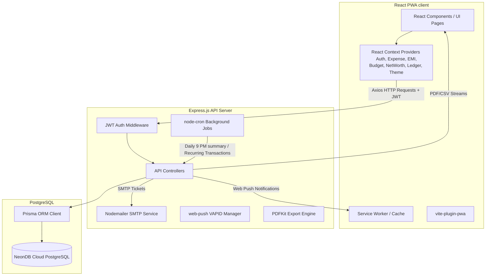

# MoneySuivi: Detailed Project Description Document

**MoneySuivi** is an all-in-one personal finance ecosystem built as a modern, progressive web application (PWA). It empowers users to manage their daily expenses, track budgets, log liabilities, monitor assets, calculate loan amortisation schedules, and keep a ledger of borrowed and lent funds. It combines offline capability, real-time push notifications, custom export capabilities, and an advanced amortisation engine.

---

## Table of Contents
1. [System Architecture](#1-system-architecture)
2. [Database Schema & Data Models](#2-database-schema--data-models)
3. [Core Product Modules](#3-core-product-modules)
4. [Advanced Financial Calculation Engines](#4-advanced-financial-calculation-engines)
5. [API Routes & Controller Map](#5-api-routes--controller-map)
6. [Frontend Architecture & Page Routes](#6-frontend-architecture--page-routes)
7. [Local Setup & Environment Configuration](#7-local-setup--environment-configuration)

---

## 1. System Architecture

MoneySuivi is designed using a decoupled client-server architecture. The frontend is structured as a single-page React application compiled via Vite, while the backend acts as a stateless Express REST API. 



### Infrastructure Summary
- **Frontend Host**: Render (Static Web Hosting).
- **Backend Host**: Render (Web Service Node.js Instance).
- **Database Service**: NeonDB Serverless PostgreSQL.
- **Push Notification Engine**: Standard Web Push Protocol using VAPID keys.
- **Relational Mapping**: Prisma Client 6.

---

## 2. Database Schema & Data Models

MoneySuivi uses a relational database structure designed with safety, indexing, and referential integrity. The Prisma schema translates to the following PostgreSQL tables:

### 2.1 User
Stores profile data, overall settings, and credentials.
- `id` (String, UUID, Primary Key): Unique identifier.
- `name` (String, max length 50): User's name.
- `email` (String, Unique): E-mail used for registration.
- `password` (String): Salted & hashed password using `bcryptjs` (12 rounds).
- `budgetLimit` (Float, Default: 0): System-wide default budget constraint.
- `currency` (String, Default: "INR"): Preferred representation symbol.
- `createdAt` / `updatedAt` (DateTime).

### 2.2 Expense
Maintains all financial transactions (inflows, outflows, and transfers).
- `id` (String, UUID, Primary Key).
- `userId` (String, Foreign Key -> User.id, Cascade Delete).
- `title` (String, max length 100): Purpose of transaction.
- `amount` (Float): Absolute value of the expense/income.
- `category` (String): e.g. Food, Travel, Shopping, Salary, etc.
- `type` (String, Default: "expense"): `expense`, `income`, or `transfer`.
- `accountType` (String, Default: "Cash"): Wallet, UPI, Credit Card, Bank.
- `fromAccountType` / `toAccountType` (String, Nullable): Used during transfer transactions.
- `paymentMethod` (String, Default: "UPI").
- `note` (String, max length 500, Nullable).
- `expenseDate` (DateTime, Default: Now).
- `recurring` (Boolean, Default: false): Indicates recurring scheduling.
- `recurringType` (String, Nullable): `weekly` or `monthly`.
- `nextRunDate` (DateTime, Nullable): Next cron billing date.
- `isAutoCreated` (Boolean, Default: false): Indicates transaction was created by a cron task.
- *Indexes*: `[userId, expenseDate]`, `[userId, category]`, `[userId, accountType]`, `[recurring, nextRunDate]`.

### 2.3 Budget
Specifies custom threshold ceilings per category.
- `id` (String, UUID, Primary Key).
- `userId` (String, Foreign Key -> User.id, Cascade Delete).
- `category` (String): Target category name.
- `monthlyLimit` (Float): Allowed ceiling.
- *Unique Constraint*: `[userId, category]` (Allows only one budget constraint per category per user).

### 2.4 EMI (Loans & Repayment Schemes)
Supports fixed installment amortisation and flexible anniversary accrual interest models.
- `id` (String, UUID, Primary Key).
- `userId` (String, Foreign Key -> User.id, Cascade Delete).
- `title` (String, max length 100): Name of loan or debt.
- `totalAmount` (Float): Initial Principal amount.
- `emiAmount` (Float, Nullable): Standard amount expected per term (Fixed EMI).
- `totalInstallments` (Int, Nullable): Total duration in months.
- `paidInstallments` (Int, Default: 0): Current payment count progress.
- `paidAmount` (Float, Default: 0): Cumulative sum of all cash paid towards this loan.
- `startDate` (DateTime): Loan commencement date.
- `nextDueDate` (DateTime, Nullable).
- `note` (String, max length 500, Nullable).
- `active` (Boolean, Default: true): Indicates whether the loan is outstanding or settled.
- `type` (String, Default: "FIXED"): `FIXED` or `FLEXIBLE`.
- `interestRate` (Float, Nullable): Annual interest percentage.
- *Indexes*: `[userId, active]`.

### 2.5 EMIPayment
Individual transaction records logged under an EMI structure.
- `id` (String, UUID, Primary Key).
- `emiId` (String, Foreign Key -> EMI.id, Cascade Delete).
- `amount` (Float): Payment amount.
- `paidAt` (DateTime, Default: Now).
- `note` (String, max length 500, Nullable).
- *Indexes*: `[emiId]`.

### 2.6 Asset & Liability (Net Worth Ledger)
Allows tracking long-term assets and debts not registered as normal EMI schemes.
- **Asset**:
  - `id` (String, UUID, Primary Key).
  - `userId` (String, Foreign Key -> User.id, Cascade Delete).
  - `name` (String, max length 100): Investment, property, savings.
  - `type` (String): e.g. Cash, Real Estate, Crypto, Mutual Funds.
  - `value` (Float): Estimated valuation.
  - `note` (String, max length 500, Nullable).
- **Liability**:
  - `id` (String, UUID, Primary Key).
  - `userId` (String, Foreign Key -> User.id, Cascade Delete).
  - `name` (String, max length 100): Credit card debt, mortgage, private loan.
  - `type` (String).
  - `value` (Float): Current liability amount.
  - `note` (String, max length 500, Nullable).
- *Indexes*: `[userId]`.

### 2.7 LedgerContact & LedgerEntry (Borrow & Lend Module)
Provides a digital registry tracking short-term peer-to-peer exchanges (borrowing or lending).
- **LedgerContact**:
  - `id` (String, UUID, Primary Key).
  - `userId` (String, Foreign Key -> User.id, Cascade Delete).
  - `name` (String, max length 50).
  - `phone` (String, max length 20, Nullable).
  - `note` (String, max length 300, Nullable).
  - *Indexes*: `[userId]`.
- **LedgerEntry**:
  - `id` (String, UUID, Primary Key).
  - `userId` (String, Foreign Key -> User.id, Cascade Delete).
  - `contactId` (String, Foreign Key -> LedgerContact.id, Cascade Delete).
  - `type` (String): `LENT`, `BORROWED`, `REPAYMENT_RECEIVED`, or `REPAYMENT_MADE`.
  - `amount` (Float): Principal exchanged.
  - `date` (DateTime, Default: Now).
  - `note` (String, max length 500, Nullable).
  - `settled` (Boolean, Default: false).
  - *Indexes*: `[userId, contactId]`, `[userId, date]`.

### 2.8 Notification & PushSubscription
Houses in-app notifications and tracks user devices for push alerts.
- **Notification**:
  - `id` (String, UUID, Primary Key).
  - `userId` (String, Foreign Key -> User.id, Cascade Delete).
  - `category` (String): Target theme/category or warning context.
  - `percentage` (Float, Default: 0): For tracking budget breach levels.
  - `message` (String).
  - `type` (String, Default: "warning"): `warning`, `info`, or `critical`.
  - `read` (Boolean, Default: false).
  - `createdAt` (DateTime, Default: Now).
  - *Indexes*: `[userId, read]`.
- **PushSubscription**:
  - `id` (String, UUID, Primary Key).
  - `userId` (String, Foreign Key -> User.id, Cascade Delete).
  - `endpoint` (String, Unique): Browser push gateway URL.
  - `p256dh` (String): Client public key string.
  - `auth` (String): Auth token from browser push service.
  - *Indexes*: `[userId]`.

---

## 3. Core Product Modules

### 3.1 Authentication & Security
Uses JSON Web Tokens (JWT) for secure, stateless user sessions. Password hashes use `bcryptjs` with a work factor of 12. Token headers are monitored client-side via an Axios Interceptor that injects the authorization token (`Bearer <token>`) and handles expired token redirects.

### 3.2 Transaction Log & Multi-Account Operations
Users can categorise transactions into Income, Expenses, and Transfers. A "Transfer" allows moving balances between internal accounts (e.g. from Wallet to Credit Card, or Bank to Cash) by logging dual-account adjustments, avoiding falsifying standard income or expense totals.

### 3.3 Smart Budget Manager & Overrun Breach Engine
Enables setting budget ceilings on individual categories. As transactions are logged, the backend evaluates the running monthly total of that category against the user's budget ceiling. 
- **Calculations & Severity Alerts**:
  - *Warning* level: Spending reaches $\ge 80\%$ of the budget ceiling.
  - *Critical* level: Spending reaches $\ge 100\%$ of the budget ceiling.
- **Web Push Trigger**: If thresholds are crossed, instant web push alerts are sent using VAPID to subscribed active client devices.

### 3.4 Amortisation & Loan Tracker
Includes a specialized calculation engine supporting:
1. **Fixed EMI Model**: Displays payment structures, principal paid, interest paid, and remaining balance using an amortisation schedule.
2. **Flexible Anniversary Interest Model**: Recalculates outstanding principal monthly based on custom repayments, interest accruals, and start-date anniversaries.

### 3.5 Contact Borrow / Lend Ledger
A sub-ledger tracking peer exchanges. Per-contact logs display net summaries indicating whether you owe the contact or they owe you money, with optional settlement checkboxes to close outstanding balances.

### 3.6 Automated Task Scheduler
Driven by `node-cron` inside the API backend process, which performs:
1. **Recurring Expenses Generation**: Scans daily for records flagged `recurring = true` where `nextRunDate <= Today`. The system automatically duplicates the transaction, registers it in the Database, and increments `nextRunDate` (`weekly` or `monthly`).
2. **Daily 9 PM Summary Push**: Delivers a daily spending summary to all users who have active browser push subscriptions.

---

## 4. Advanced Financial Calculation Engines

The loan module calculates loan details dynamically on-the-fly (`backend/utils/loanUtils.js` / `frontend/src/utils/constants.js`), ensuring database records stay lightweight.

### 4.1 Fixed EMI Loan Calculation
When a loan has a fixed number of terms ($N$), an annual interest rate ($R$), and a defined EMI payment ($E$):

* **Monthly Interest Rate ($r$)**:
  $$r = \frac{R}{12 \times 100}$$

* **Total Payable Amount**:
  $$\text{Total Payable} = E \times N$$

* **Interest and Principal Breakdown (Amortisation Schedule)**:
  To find the exact principal and interest paid up to installment $m$, the system iterates from terms $k = 1$ to $m$:
  $$\text{Interest Paid in month } k = \text{Remaining Principal} \times r$$
  $$\text{Principal Paid in month } k = \min(E - \text{Interest Paid}, \text{Remaining Principal})$$
  $$\text{New Remaining Principal} = \text{Remaining Principal} - \text{Principal Paid}$$

* **Remaining Balance**:
  Derived directly as the outstanding principal at step $m$ (not a simple subtraction of payments from total amount), representing the actual amount needed to pay off the loan.

---

### 4.2 Flexible Loan Calculation (Anniversary Accrual)
Flexible loans have no fixed monthly EMI or term limit. Instead, they accrue interest on a monthly anniversary basis, and payments can be made in arbitrary amounts at any time.

1. **Collect and Sort Events**:
   Events are generated for:
   - All repayments (from the database log).
   - Monthly anniversaries of the loan start date.
   
   These events are sorted chronologically. If an anniversary and repayment occur on the same day, the anniversary interest is processed first.

2. **Simulation Loop**:
   Initialize:
   $$\text{Outstanding Principal} = \text{Initial Principal } (P)$$
   $$\text{Accrued Interest} = 0$$
   $$\text{Interest Paid} = 0$$
   $$\text{Principal Paid} = 0$$

   * **On Anniversary Event**:
     If outstanding principal is $> 0$, accrue interest for the past month:
     $$\text{Interest Accrued} = \text{Interest Accrued} + \left(\text{Outstanding Principal} \times \frac{R}{100 \times 12}\right)$$

   * **On Repayment Event (Amount = $A$)**:
     Repayments are applied to interest first, then to the principal:
     $$\text{Unpaid Interest} = \text{Interest Accrued} - \text{Interest Paid}$$
     $$\text{Interest Payment} = \min(A, \text{Unpaid Interest})$$
     $$\text{Principal Payment} = \min(A - \text{Interest Payment}, \text{Outstanding Principal})$$
     $$\text{Interest Paid} = \text{Interest Paid} + \text{Interest Payment}$$
     $$\text{Principal Paid} = \text{Principal Paid} + \text{Principal Payment}$$
     $$\text{Outstanding Principal} = \text{Outstanding Principal} - \text{Principal Payment}$$

3. **Output Metrics**:
   - **Remaining Balance**: Outstanding Principal + (Interest Accrued - Interest Paid).
   - **Total Payable Amount**: $P$ + Interest Accrued.

---

## 5. API Routes & Controller Map

All API routes are prefixed with `/api` and require a valid JWT token in the `Authorization` header, except for public authentication endpoints.

### 5.1 Auth Endpoints (`/api/auth`)
- `POST /register`: Registers a new user.
- `POST /login`: Validates credentials and returns a JWT.
- `GET /me`: Returns the current user's profile.
- `PUT /profile`: Updates name or password.
- `POST /forgot-password`: Generates reset flows.
- `DELETE /reset`: Wipes all transaction data for the user.

### 5.2 Transaction Endpoints (`/api/expenses`)
- `GET /`: Returns a list of transactions with optional search and date filters.
- `POST /`: Creates an expense, income, or transfer. Checks and logs budget breaches.
- `PUT /:id` / `DELETE /:id`: Edits or deletes a transaction.
- `GET /analytics`: Provides category breakdowns and monthly income vs. expense comparisons.

### 5.3 Export Endpoints (`/api/export`)
- `GET /csv`: Streams transactions formatted as a CSV.
- `GET /pdf`: Generates and streams a PDF transaction report using `PDFKit`.

### 5.4 Budget Endpoints (`/api/budgets`)
- `GET /` / `POST /`: Lists and creates budget ceilings.
- `PUT /:id` / `DELETE /:id`: Updates or deletes budget rules.

### 5.5 Loan Endpoints (`/api/emis`)
- `GET /`: Lists all active and completed loans with computed remaining balances.
- `POST /`: Creates a fixed EMI or flexible loan.
- `PATCH /:id/pay`: Logs a new repayment entry under `EMIPayment`.
- `DELETE /:id`: Deletes a loan.
- `DELETE /payments/:paymentId`: Deletes an individual repayment entry.

### 5.6 Net Worth Endpoints (`/api/networth`)
- `GET /summary`: Compiles assets vs. liabilities to calculate net worth.
- `GET/POST /assets` & `/liabilities`: Manages asset and liability records.

### 5.7 Ledger Endpoints (`/api/ledger`)
- `GET /summary`: Returns overall borrowed and lent balances.
- `GET/POST /contacts`: Manages ledger contacts.
- `GET/POST /contacts/:id/entries`: Manages ledger transactions for a contact.

### 5.8 Notification Endpoints (`/api/notifications`)
- `GET /`: Returns read and unread notifications.
- `PUT /read-all`: Marks all notifications as read.
- `POST /subscribe`: Registers browser Web Push endpoint and VAPID keys.
- `DELETE /unsubscribe`: Clears push subscriptions.

---

## 6. Frontend Architecture & Page Routes

The frontend is built using **React 18** and **Vite 5**. Styling uses **Tailwind CSS 3** for a modern, responsive interface with system dark/light mode integration.

### 6.1 State Management (Context API)
Global state is organized into specialized React Contexts, keeping state updates isolated and preventing unnecessary re-renders:
- `AuthContext`: Manages login state, JWT storage, and local storage state.
- `ExpenseContext`: Handles transactions, analytical queries, and filters.
- `BudgetContext`: Syncs and checks budget thresholds.
- `EMIContext`: Communicates with the loan calculation engines.
- `NetWorthContext`: Manages assets, liabilities, and aggregates net worth.
- `LedgerContext`: Handles peer borrowed/lent balances.
- `NotificationContext`: Receives in-app notifications and configures web push permissions.
- `ThemeContext`: Toggles between light and dark modes.

### 6.2 Router Configuration (React Router v6)
Routes are set up using `HashRouter` to support reliable routing within the PWA package:
- Public Routes: `/login`, `/register`.
- Private Routes (Protected by `Layout` Shell & Navigation Bar):
  - `/` (Dashboard): Shows net worth, cash flow charts, recent transactions, and budget alerts.
  - `/history`: Transaction history with category filters and search.
  - `/add` / `/edit/:id`: Add or modify transaction entries.
  - `/analytics`: Spending breakdowns using Recharts ring and area charts.
  - `/budgets`: Budget category setup and limit trackers.
  - `/emis`: Loan and amortisation schedule dashboard.
  - `/networth`: Asset and liability registers.
  - `/ledger`: Contact list and borrow/lend summaries.
  - `/notifications`: View and clear in-app alerts.
  - `/profile`: Profile details, password resets, data wipe, and helpdesk tickets.

---

## 7. Local Setup & Environment Configuration

### Prerequisites
- Node.js (version 18 or above).
- A running PostgreSQL database (local instance or cloud database like Neon.tech).

### Environment Variables (.env)

#### Backend Configuration (`backend/.env`)
```env
PORT=5000
DATABASE_URL="postgresql://<user>:<password>@<host>/<db>?sslmode=require"
DIRECT_URL="postgresql://<user>:<password>@<host>/<db>?sslmode=require"
JWT_SECRET=any_secure_random_string
JWT_EXPIRE=7d
NODE_ENV=development
VAPID_PUBLIC_KEY="your_vapid_public_key"
VAPID_PRIVATE_KEY="your_vapid_private_key"
EMAIL_HOST=smtp.gmail.com
EMAIL_PORT=587
EMAIL_USER=admin_email@gmail.com
EMAIL_PASS=smtp_app_password
EMAIL_TO=admin_inbox@gmail.com
```

#### Frontend Configuration (`frontend/.env`)
```env
VITE_API_URL=http://localhost:5000/api
```

### Installation Steps

1. **Database Migration**:
   Run database migrations to set up the schema:
   ```bash
   cd backend
   npm install
   npx prisma generate
   npx prisma migrate dev
   ```

2. **Start Backend**:
   Start the Express development server:
   ```bash
   npm run dev
   ```

3. **Start Frontend**:
   Install dependencies and start the Vite server:
   ```bash
   cd ../frontend
   npm install
   npm run dev
   ```
